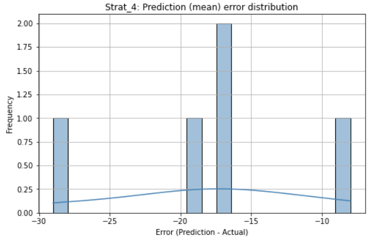
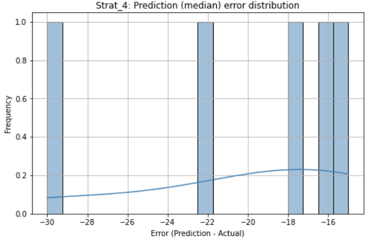
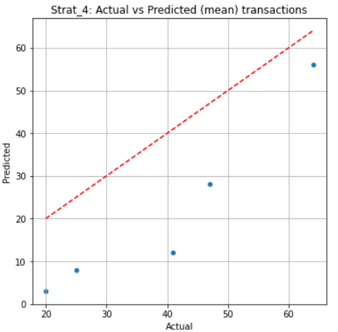
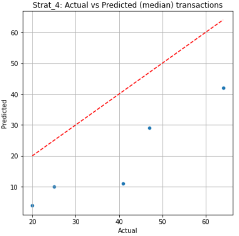
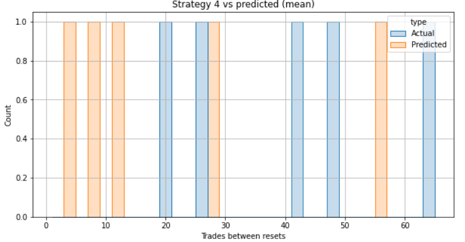
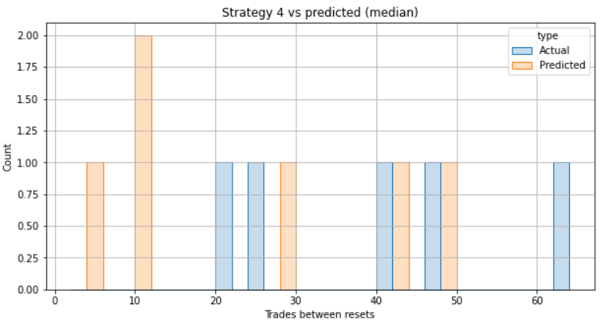

# DSF Model Evaluation Report

## Methodology Overview

This report evaluates the predictive accuracy of the Raindex DSF model, which estimates the number of trades expected between resets. Accurate prediction is critical for determining optimal trade size relative to vault capital in dual-token strategies.

### Inputs

* **Actual data**:  Historical strategy trading data from Raindex (CSV files).
* **Pool data**:  Historical DEX trading data to make predictions about how the strategy should be configured (CSV files).
* **Model predictions**: Excel model (`template_dsf_model.xlsx`) with sheets for multiple calibration intervals (15M, 30M, 60M, 90M).
* **Matching**: Model sheet is selected based on average/median trade frequency of each strategy.

### Steps

1. Load and clean both actual and pool data. Find transactions in actual data that represent reset positions. Calculate number of trades between resets. 
2. Create copies of pool data filtered by trading period of each strategy and save in CSV files.
3. Write these filtered transactions from pool data into 'Data' sheet of the respective copy of the model template file.
4. User needs to assure the model evaluated the new data and calibration sheets of the model are updated. 
5. Perform distribution analysis of trade frequency in actual data.
6. Use mean and median trade frequencies to choose the closest calibration sheet in the model.
7. Load model predictions for each strategy.
8. Perform distribution comparison:
   * Min, max, mean, median, std, cv, mad 
   * Interquartile range
   * Skew, kurtosis
   * 95% confidence intervals
   * Number of trades, number of resets, % resets
9. Run hypothesis testing (t-test, Mann–Whitney U) to assess statistical significance.
10. Compute statistical error metrics:
    * MAE, RMSE, MAPE
11. Visualize:
    * Prediction error distribution
    * Actual vs predicted scatter
    * Time between trades histogram
---

## Statistical Analysis of Model Performance

**Strategy from the `base-0x77b971ba727992deff71b24b9a2e0363e61f20d7bef8d0fd64164d3cec3b8edf.csv` CSV file is used here as an example.**
The dex data is imported from `wlth-usdc-pool-0x1536ee1506e24e5a36be99c73136cd82907a902e.csv`. For the reference to the example_analysis notebook the stategy herein is refered to as `strategy 4`.

### Summary Metrics per Strategy

| Strategy         | MAE  | RMSE | MAPE  | Mean Actual | Mean Predicted | Prediction Bias |
| ---------------- | ---- | ---- | ----  | ----------- | -------------- |-------------- |
| Strat 4 (mean)   | 18.0 | 19.2 | 55.3% | 39.4        | 21.4           |    -45.7%     |
| Strat 4 (median) | 20.2 | 20.9 | 57.2% | 39.4        | 24.2           |    -38.6%     |

> *Model tends to underpredict in strategy 4 in both mean and median calibrated prediction results.*

### Distribution Characteristics

| Metric             | Strategy 4    | Prediction (mean)  |  Prediction (median)  |
|--------------------|---------------|--------------------|-----------------------|
| Number of trades   | 268.00        | 143.00             | 206.00                |
| Number of resets   | 5.00          | 5.00               | 6.00                  |
| % resets           | 1.87          | 3.50               | 2.91                  |
|--------------------|---------------|--------------------|-----------------------|
| Mean               | 39.40         | 21.40              | 24.17                 |
| Median             | 41.00         | 12.00              | 20.00                 |
| Std Dev            | 17.67         | 21.49              | 18.65                 |
| CV                 | 0.45          | 1.00               | 0.77                  |
| MAD                | 16.00         | 9.00               | 13.00                 |
| Min - Max          | \[20.0, 64.0] | \[3.0, 56.0]       | \[4.0, 49.0]          |
| IQR                | 22.000000     | 20.000000          | 28.500000             |
| skew               | 0.255385      | 0.908134           | 0.262541              |
| kurtosis           | -1.224267     | -0.670438          | -1.575712             |
| 95% CI             |\[17.46, 61.34]| \[-5.28, 48.08]    | \[4.60, 43.74]        |

> - Predicted number of resets is identical to the actual number of resets (5) when calibration sheet is chosen with mean (\~85 min -> 90M). When calibration is done using median (~50 min -> 60M) there is one more predicted reset (6).  
> - Predicted total number of trades in both cases are lower than the actual number of trades. As expected there are less 90M trades compared to 60M. Given the heavy right skew of the actual distribution, the mean value could be overestimated due to the heavier tail.  
> - In both prediction cases the percentage of resets is higher due to the lower number of total trades. This could cause underestimation for the number of trades between resets in predicted distributions. 
> - Predicted mean/median number of trades between resets is around half of that of actual data with predicted 95\% CI covering only lower half of that of the actual.
> - Overall, predictions using the calibration based on median trade frequency is closer in shape and spread to the actual data. However, the mean trade count is underestimated in both prediction cases. 

### Hypothesis testing

1. **t-test significance**

| Prediction         | p-value       |
|--------------------|---------------|
|Based on mean       | 0.187388      |
|Based on median     | 0.199205      |

> In both cases the t-test is not statistically significan, so similarity of mean number of trades between resets of actual and predicted distributions could not be rejected.

2. **Mann–Whitney U-test significance**

| Prediction         | p-value       |
|--------------------|---------------|
|Based on mean       | 0.222222      |
|Based on median     | 0.329004      |

> In both cases the Mann–Whitney U-test is not statistically significan, so similarity of distribution of number of trades between resets of actual and predicted datasets could not be rejected.
---

## Key Visualizations

1. **Prediction Error Distribution**

Predictions based on mean             |  Predictions based on median
:-------------------------:|:-------------------------:
 |  

   * Histograms show errors located in negative part → underprediction.

2. **Actual vs Predicted Scatter Plot**

Predictions based on mean             |  Predictions based on median
:-------------------------:|:-------------------------:
 |  

   * All points lie below the diagonal → predicted < actual.

3. **Number of trades between resets Actual vs Predicted Histogram**

Predictions based on mean             |  Predictions based on median
:-------------------------:|:-------------------------:
 |  

* Both predicted distributions are shifted toward lower values. In neither case the predicted trade count span covers the full actual range.

---